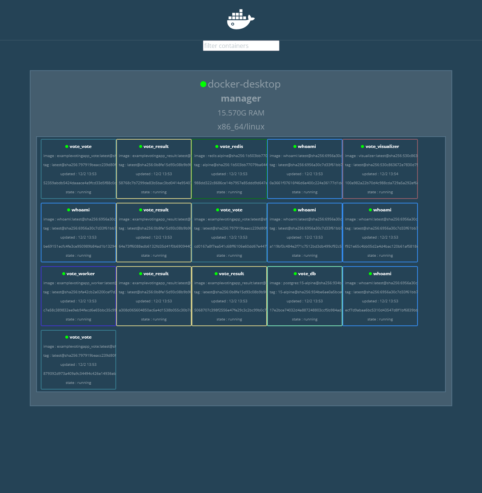

# Exercice Docker Swarm avec Play With Docker (PWD)

## Introduction
Ce README documente les étapes que j'ai réalisées pour effectuer l'exercice Docker Swarm en utilisant Play With Docker (PWD). L'exercice implique la création d'un cluster Docker Swarm multi-nœuds, le déploiement de services et la gestion des nœuds au sein du cluster.

## Configuration du Cluster
Le cluster Docker Swarm a été initialisé sur PWD avec deux nœuds :

- `node1` en tant que manager (Leader)
- `node2` en tant que worker

- Voici un exemple:


## Déploiement du Service
Le service `whoami` a été déployé avec 5 répliques réparties entre les nœuds pour démontrer l'équilibrage de charge et la réplication de service.

- Nom du Service : `whoami`
- Répliques : 5
- Port Publié : 80


## Inspection du Service
J'ai inspecté le service `whoami` pour vérifier la configuration et la réplication à travers le Swarm.

```bash
$ docker service inspect --pretty whoami
```


## Accès au Service
L'accès au service `whoami` depuis différents nœuds a montré des informations changeantes, indiquant que les requêtes étaient traitées par différentes répliques, illustrant ainsi l'équilibrage de charge de Docker.

- Exemple de réponse :
```
Hostname: 7f494f8efeb1
IP: 127.0.0.1
IP: 10.0.0.9
RemoteAddr: 10.0.0.2:34109
...
```


- Après actualisation de la page je dois obtenir une IP différente:


## Visualisation du Cluster
J'ai utilisé Docker-Swarm-Visualizer pour visualiser l'état et l'architecture du cluster Docker Swarm.



## Gestion des Nœuds
L'exercice comprenait la pratique des changements de rôle des nœuds au sein du cluster, tels que la promotion et la rétrogradation des nœuds, ainsi que la mise en mode de maintenance d'un nœud (drain).


